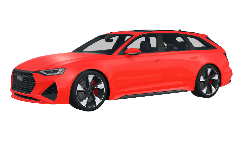

# Vehículos

Los **vehículos** pueden ser **spawneados** sin tener que **comprarlos in-character**. Cada **organización** criminal o legal (LAPD, LASD, LAFD, etc…) podrá **restringir** el **uso** de sus **vehículos** a sus **miembros** en servicio. A continuación, se encuentra una **lista** de los vehículos **prohibidos** o **exclusivos** del servidor. Se define como **exclusivo** cualquier vehículo **restringido al público general**, como por ejemplo, los exclusivos de **boosters** o **premium**.

| <mark style="color:$primary;">**FOTO**</mark>                              | <mark style="color:$primary;">**NOMBRE**</mark> | <mark style="color:$primary;">**CLASE**</mark> | <mark style="color:$primary;">**RESTRICCIÓN**</mark> |
| -------------------------------------------------------------------------- | ----------------------------------------------- | ---------------------------------------------- | ---------------------------------------------------- |
|      | 
Averon Bremen VS Garde
                | Normal                                         | PROHIBIDO                                            |
|  | Kovak Heladera                                  | Eléctrico                                      | PROHIBIDO                                            |
| 
 
                                                                | 
Vehículos eléctricos
                  | Eléctrico                                      | 
EXCLUSIVO BOOSTER O PREMIUMS
               |
